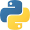

#  PythonBook

The PythonBook is a Python repository containing the code examples found in its tutorials. These examples were published using Python version 2, they had been converted to Python version 3.

This repository is part of my self training in Python version 3, because of that you could also find **.py** files no appearing in the **PythonBook**, the Python Applications section in this readme file identify them.

## Conventions

The original source code files are identified with a **_v1.py** tag, new versions with improvements are
## Installation

You should download the GitHub's master zip to a local folder in your machine.

## Usage

You can open anyone of these files with PyCharm and study their content.

## Contributing
Pull requests are welcome. For major changes, please open an issue first to discuss what you would like to change.

Please make sure to update tests as appropriate.

## License
[MIT](https://choosealicense.com/licenses/mit/)

## Python Applications

